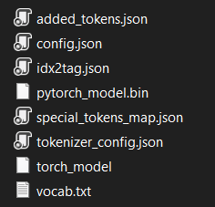
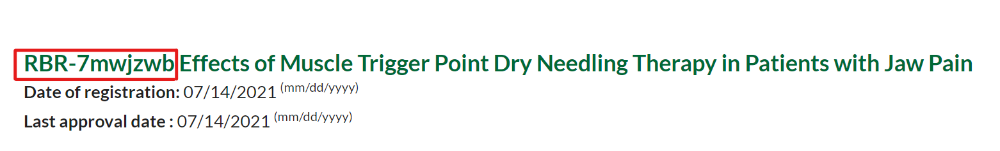

# Clinical NPL Trial Recruitment (CliNTREc)

A cohort selection system for clinical trials

## Installation

[Download](https://github.com/paivagio/CliNTREc/archive/refs/heads/main.zip) the repository and make sure you have all the required dependecies installed.

## Dependecies 

Use the package manager [pip](https://pip.pypa.io/en/stable/) to install the dependecies bellow, if you don't already have them.

```bash
$ pip install numpy
$ pip install bs4
$ pip install nltk
$ pip install lxml
$ pip install progress
$ pip install transformers
$ pip install stanza
$ pip install gensim
```

Download the [BioBERTpt NER model](https://github.com/HAILab-PUCPR/BioBERTpt/tree/master/model) from [lisaterumi](https://github.com/lisaterumi) and put it on **models/BioBertPtAllClinPt** folder. Your folder should look like this when done:



## Usage

The system is run by command line but you can also use the useful wrapper provided. Bellow are listed the available parameters and usage sintax.

### 1. Sintax

**Prefix:** `python main.py`

| Parameter | Default | Description  |
|----------|---------|--------------|
| `-h`     |     | Help message |
| `-i`     | temp    | Input folder |
| `-o`     | temp  | Output folder |
| `-t`     | ec.txt  | Clinical trial filename |
| `-id`    |   | Clinical trial ID |
| `-e`     |   | Patient's EHR filename |
| `-s`     | False  | Run cohort selection system |

### 2. Input format

This system accepts text file input for both clinical trial and EHR tasks. The text file needs to be in a specific format that is showcased in the example files in **temp** folder. It is also possible to use a clinical trial's ID. For detailed information please refer to the descriptions bellow. 

#### Clinical trial text file
> The clinical trial text file consists of two lines, the first containing the inclusion criteria and the second the exclusion criteria

#### Clinical trial ID
> The clinical trial ID must be collected from [ReBEC (Registro Brasileiro de Ensaios Clínicos)](https://ensaiosclinicos.gov.br/) and can be found on the header of any clinical trial (see picture bellow).
>
> 


#### EHR text file
> The EHR text file consists of 6 follow-on topics (see bellow). The topics are in portuguese and must remain as shown, otherwise the algorithm won't work.
>
> ID: Patient's ID (just for identification, fill as you like)\
> Idade\*: Patient's age\
> Sexo: Patient's gender\
> CID: The International Classification of Diseases (ICD) related to the EHR\
> Data de nascimento: Pacient's birth date\
> RES\*: Pacient's EHR free-text
>
> \* Critical! The absence of this topic will interfere in the overall perfomance of the system.

### 3. Eligibilty Criteria Extraction

- From text file


```bash
python main.py -i "input folder" -o "output folder" -t "filename.txt"
```

- From ID

```bash
python main.py -i "input folder" -o "output folder" -id "trial id"
```

### 4. EHR Information Extraction

```bash
python main.py 
```

### 5. Cohort selection
```
```

## Contributing
Pull requests are welcome. For major changes, please open an issue first to discuss what you would like to change.

Please make sure to update tests as appropriate.

## License
[MIT](https://choosealicense.com/licenses/mit/)

## Status
**Work in progress...**
